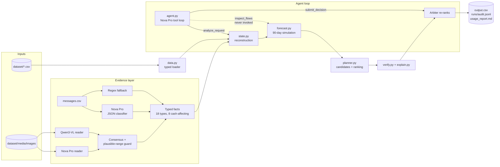

<div align="center">

# Buy or Wait?

### A financial decision agent that tells a person whether they can safely afford a purchase today, with a plan, later, or not at all

[](https://www.python.org/)
[](https://aws.amazon.com/bedrock/)
[](code/tests/)
[](code/evaluation/audit.py)
[-blue)](code/requirements.txt)
[](#license)

[**Repository**](https://github.com/adarshcod30/buy-or-wait-financial-agent) &nbsp;·&nbsp; [**Architecture**](docs/ARCHITECTURE.md) &nbsp;·&nbsp; [**Design notes**](code/DESIGN_NOTES.md) &nbsp;·&nbsp; [**Policy experiments**](code/evaluation/policy_experiments.md) &nbsp;·&nbsp; [**Usage report**](code/evaluation/usage_report.md)

*Built for **HackerRank Orchestrate, September 2026**, a 24-hour agentic-AI hackathon. The organizer starter README is kept in [docs/ORGANIZER_STARTER_README.md](docs/ORGANIZER_STARTER_README.md); the challenge text is in [problem_statement.md](problem_statement.md).*

</div>

---

## Table of Contents

- [Overview](#overview)
- [Key Features](#key-features)
- [Tech Stack](#tech-stack)
- [System Architecture](#system-architecture)
- [Request Flow](#request-flow)
- [Financial Reconstruction Pipeline](#financial-reconstruction-pipeline)
- [Results](#results)
- [What Was Tried and Rejected](#what-was-tried-and-rejected)
- [Known Limitations](#known-limitations)
- [Deployment and Infrastructure](#deployment-and-infrastructure)
- [Project Structure](#project-structure)
- [Getting Started](#getting-started)
- [Usage and CLI Reference](#usage-and-cli-reference)
- [Testing](#testing)
- [Safety and Edge Cases](#safety-and-edge-cases)
- [Roadmap](#roadmap)
- [Contributing](#contributing)
- [License](#license)
- [Contact](#contact)

---

## Overview

**Problem.** "Can I afford this laptop?" is not a balance check. The honest answer depends on the
rent due next week, the salary that lands on the 15th, a pending card authorisation, a payroll
message saying next month's pay is reduced, a bill whose amount only exists in a photo, and the
minimum balance the person refuses to go below. It also depends on what the person will accept:
119 of the 275 users in this dataset will not consider installments at all.

**Solution.** For each of 250 requests the agent reconstructs the user's cash position from a
25,342-row ledger, interprets 215 messages and 16 document images into typed facts, forecasts the
balance day by day for 90 days, enumerates every payment plan the seller offers and the user
accepts, keeps only the plans that never breach the minimum balance, ranks them by the challenge's
rule, and writes one verified row with a grounded explanation.

**Why it matters.** Every number in the output traces to a line in the ledger, a fact from a
message, or a branch in the code. The model is used where the data is unstructured (messages,
images, choosing and explaining among verified candidates), never for arithmetic.

**The guardrail is not decorative.** On `request_178` the forecast said the full amount was safe
and the model recommended paying in full. Its arithmetic was correct and its answer was wrong:
that user's `payment_methods_user_will_consider` is `partial_payment|installments`, so full
payment was never eligible. The arbiter overrode it with three installments. That happened once in
250 requests, and it is the clearest argument for the architecture.

**Keywords:** `financial-agent` `cash-flow-forecasting` `amazon-bedrock` `nova-pro` `tool-use`
`structured-extraction` `vision-language-model` `deterministic-verification` `metamorphic-testing`
`hackerrank-orchestrate`

## Key Features

| Feature | Description |
|---|---|
| 90-day safety simulation | Day-by-day balance path from reconstructed flows; `amount_safe_to_pay` and the earliest safe full-payment date fall out of it directly |
| Income-cycle capacity horizon | Capacity is measured to the last projected income date rather than the arbitrary 90-day cut, while plans are still validated across the full 90 days. Worth 10 categorical hits (115 → 125) |
| Typed evidence layer | 18 closed fact types; messages classified by Nova Pro with strict JSON at temperature 0, regex fallback over the observed templates, only 8 types may touch cash |
| Two-reader image extraction | Nova Pro and Qwen3-VL read every document image; disagreements resolved by the user's plausible range, then by the evidence line |
| Evidence coverage guard | Extraction that does not cover every message and image is refused rather than silently saved. Added after a stale cache cost 3 categorical hits without tripping any other check |
| Plan search with preferences | Full, partial (two payments), each seller installment option, wait, and spending-change variants, filtered by the user's accepted methods and installment horizon |
| Smallest-disruption spending changes | Up to three stop/reduce actions on permitted flexible series, chosen by minimal monthly saving, never on a protected category |
| Agent loop with an arbiter | The model drives `analyze_request` and `submit_decision`; the deterministic ranking is re-applied so a model choice cannot alter a graded field silently |
| Contract verifier with self-repair | Every rendered row is re-checked against the submission contract before it is written; if the top-ranked plan fails, the next-ranked safe plan is emitted instead of an invalid row |
| Per-candidate proof trace | Every candidate records whether its counterfactual forecast held, its lowest projected balance and the first date it breached: 321 proofs and 645 recorded rejections across the 250 requests |
| Grounded explanations | Six templates derived from the solved samples, filled from the decision object, with a numeric consistency check. The model's rationale is audit-only and never reaches a graded field |
| Runs without a key | `--mode deterministic` produces a valid `output.csv` from bundled evidence when the provider is unavailable |
| Reproducible from cold | Unzipping the submission with every AWS variable cleared reproduces `output.csv` byte for byte |

## Tech Stack

| Layer | Technology | Why |
|---|---|---|
| Language | Python 3.11+, standard library | 25k rows does not need pandas; dataclasses and dicts add nothing for a reader to install |
| Model provider | Amazon Bedrock Converse API, `us-east-1` | One API surface across nine candidate models, native tool use |
| Primary model | `us.amazon.nova-pro-v1:0` | Chosen on measurement: 16/16 images, 14/14 messages, p50 1.25 s |
| Second-opinion vision model | `qwen.qwen3-vl-235b-a22b` | Independent reader for image amounts |
| SDK | `boto3` with `botocore[crt]` | The only runtime dependency |
| Caching | Content-addressed JSON under `.cache/llm/` | Re-runs are free; usage still counted at original token cost |
| Testing | `pytest`, 47 tests, no network | 24 example-based, 23 metamorphic |
| Secrets | AWS credential chain only | Nothing in the repo; verified by a check that greps the shipped source |

## System Architecture

The system is a deterministic financial core wrapped by an agent. Structured data flows through
typed loaders into a reconstruction that produces dated cash flows; unstructured evidence
(messages, images) is turned into typed facts by the model and applied to those flows under fixed
rules; the simulator, planner and verifier are pure functions of the result. The model sits on top
as an orchestrator: it calls the tools, chooses among verified candidates and writes the
rationale. An arbiter re-applies the ranking rule after the model submits.



**The trust boundary.** Eighteen fact types exist and only eight may move money. Anything a
message says that does not map to one of those eight has no representation in the forecast and
therefore no effect. The corpus's one injection-shaped message, a prize-release-fee solicitation,
maps to `scam_solicitation` and is inert by construction rather than because a filter caught it.

## Request Flow

```mermaid
sequenceDiagram
    participant CLI as main.py run
    participant EV as evidence.py
    participant M as Nova Pro / Qwen3-VL
    participant AG as agent.py
    participant CORE as state / forecast / planner
    participant V as verify + explain
    CLI->>EV: build_evidence (once per run, cached)
    EV->>M: classify 215 messages, read 16 images
    M-->>EV: JSON facts
    EV->>EV: coverage guard; refuse an incomplete extraction
    loop for each of 250 requests
        CLI->>AG: run_agent(request, facts)
        AG->>M: system prompt + tools
        M->>AG: analyze_request(request_id)
        AG->>CORE: reconstruct -> simulate -> candidates
        CORE-->>AG: forecast, candidates, rejected reasons
        AG-->>M: tool result (JSON)
        M->>AG: submit_decision(candidate_id, rationale)
        AG->>V: render explanation, verify row
        V-->>AG: row + problems
        AG->>AG: arbiter re-applies ranking, records agreement
        AG-->>CLI: verified row + trace
    end
    CLI->>CLI: write output.csv, audit.jsonl, run_summary.json, usage_report.md
```

Every one of the 250 requests took exactly two turns: `analyze_request`, then `submit_decision`.
`inspect_flows` is declared and wired as an escape hatch for when evidence and forecast appear to
disagree, and no request in this corpus triggered it.

## Financial Reconstruction Pipeline

This project has no trained model; the pipeline reconstructs a financial state and forecasts it.
Each stage below names what it reads, what it decides, and where that decision was validated.

### 1. Data sources and joins

| File | Rows | Notes |
|---|---|---|
| `financial_events.csv` | 25,342 | 16 rows have a blank amount recoverable only from an image |
| `financial_profiles.csv` | 275 | 119 users will not consider installments |
| `requests.csv` | 250 | the rows to decide |
| `request_payment_options.csv` | 790 | 2 to 4 options per request |
| `messages.csv` | 215 | 45 in Indonesian |
| `images.csv` | 16 | payslips, telecom bills, a handwritten pharmacy receipt |
| `exchange_rates.csv` | 134 | dated; 5 currencies (INR, EUR, IDR, ZAR, USD) |
| `sample_requests.csv` | 25 | solved, used only for global policy selection |

Joins on `user_id`, `request_id`, `related_event_id`, and `(rate_date, from, to)`. Blank amounts
stay `None` until an image resolves them; never zero.

### 2. Cleaning and conflict resolution

- Ignored: `cancelled`, `failed`, `unrealized`, `non_cash` rows; pending credits; refunds and
  prizes until they settle (statuses are a closed set, checked programmatically).
- Reserved: pending debits (charged at request date), scheduled debits and credits on their
  settlement date.
- Duplicates: a single-occurrence salary row with the same amount within 7 days of another salary
  row is a second representation of the same payroll and is not projected twice.
- Currency: foreign rows convert at the exact rate row for their settlement date; fallbacks
  (nearest earlier, inverse, USD/EUR hop) are recorded in the audit notes, and a missing rate
  raises rather than silently using a stale one.

### 3. Recurrence and forecasting rules

| Flow | Rule | Where validated |
|---|---|---|
| Recurring income | Payroll-type descriptions only; needs two occurrences or a confirming row; stale after 45 days; stopped by a final payroll or an `income_ended` fact | samples 05, 09, 10, 13, 14 |
| Fixed commitments | Per description, monthly cadence, last amount if constant else mean; a row dated on the request date is still owed | samples 06, 19, 20 |
| Variable spending | Per category on the observed cadence, measured as the **unbucketed mean gap**; a row dated on the request date is not projected | cadence is exact across the corpus (7, 10, 14, 21 days or calendar-monthly) |
| Budget | See the table below | ratios measured on all 2,907 rows carrying a minimum |

**How the per-occurrence budget is chosen,** since this is the most misread part of the codebase.
`budget.estimate` runs on every series and sets `exact` when the budget is known rather than
estimated. Measured across the corpus's 2,747 user-category series:

| Path | Share | What it returns |
|---|---|---|
| No-noise category (rent, insurance, subscriptions) | 45.3% | the latest amount |
| Sample mean, shipped `budget_method="mean"` | 40.8% | `statistics.fmean(amounts)` |
| `minimum_allowed_amount / ratio` (0.5 dining, entertainment, gym, streaming; 0.4 shopping) | 12.7% | the exact implied budget |
| Identical observations | 1.2% | that amount |

`budget.py` also implements an order-statistics posterior (`b >= max/(1+w)`, `b <= min/(1-w)`,
likelihood `b**-n`) which is a better estimator of an individual budget, cutting mean absolute
error from 3.8% to 2.3% on the 2,907 rows whose true budget is known. It is **not** the default,
because it is worse where it counts: holding every other axis at its shipped setting it scores
118/150 categorical hits against 125/150 for the mean. Per-category errors are near-unbiased and
largely independent, so they cancel in a sum over five or six categories, while sharper per-series
estimates push a few knife-edge troughs across a threshold.

### 4. Simulation and capacity

- Balance path from `request_date` for 90 days; the trough minus `minimum_balance_to_keep`,
  clamped to `[0, requested_amount]`, is `amount_safe_to_pay`.
- `earliest_date_for_full_payment` is the first day whose suffix-minimum balance minus the full
  amount stays at or above the minimum.
- Both are measured to the **last projected income date** inside the horizon, not the raw 90-day
  cut, because that cut lands at an arbitrary point in the pay cycle and turns a trailing partial
  month into apparent insolvency. Recommended plans are still validated across the full 90 days.

### 5. Plans and ranking

- Candidates: full today; each installment option (user must accept installments,
  `number_of_payments <= max_installment_months`, starts on or after the request date, finishes by
  the deadline); partial (two payments, second on the earliest date); wait; and each of these with
  a spending-change set when needed. Every candidate is simulated in its own counterfactual
  forecast.
- Ranking: completes by deadline, no spending changes, lowest total paid, earlier start, fewer
  payments, lowest option id (`planner.Plan.sort_key`). The keys form a lexicographic total order,
  so sorting yields the unique optimum and no Pareto step is needed.

### 6. Verification

`verify.py` rejects any row violating the contract; `explain.check_consistency` rejects an
explanation whose numbers disagree with the row it describes. Problems are attached to the audit
record, and a run with problems exits non-zero.

## Results

### Provider benchmark

Nine models, identical prompts, temperature 0, on the real tasks: 16 images whose amounts were
verified by eye, and 14 message templates with typed truth.

| Model | Images | Messages | p50 latency | p95 latency | Outcome |
|---|---|---|---|---|---|
| **Nova Pro** | 16/16 | 14/14 | 1.25 s | 2.5 s | **primary** |
| Qwen3-VL 235B | 16/16 | 14/14 | 1.79 s | 5.1 s | **second reader** |
| Kimi K2.5 | 15/16 | 14/14 | 1.08 s | 5.3 s | — |
| Nova 2 Lite | 15/16 | 14/14 | 0.95 s | 1.6 s | — |
| Llama 4 Maverick | 14/16 | 14/14 | 0.68 s | 1.0 s | — |
| Mistral Large 3 | 14/16 | 13/14 | 1.04 s | 1.4 s | — |
| Nova Lite | 14/16 | 14/14 | 0.95 s | 2.6 s | — |
| GPT-OSS 120B | text only | 14/14 | 1.49 s | — | cross-check reader |
| Grok 4.6 | 0/16 | 0/14 | — | — | errors on every call |

Claude, GPT-5.6 and GPT-6 Astra appear in the Bedrock catalog but return `AccessDenied` on this
account, which is a sales gate rather than a model-access setting.

### Sample evaluation

25 solved requests, `python code/main.py evaluate`.

| Field | Exact match |
|---|---|
| `affordability_status` | 22/25 |
| `recommended_payment_method` | 23/25 |
| `payment_plan` | 22/25 |
| `earliest_date_for_full_payment` | 20/25 |
| `spending_changes_needed` | 21/25 |
| `decision_explanation` (verbatim) | 17/25 |
| **Categorical total** | **125/150** |
| `amount_safe_to_pay` within 5% | 12/25 (median relative error 6.43%) |
| Fully correct rows (all six fields) | 16/25 |

**Why the amount looks worse than the model is.** The median error on the underlying 90-day
trough is **1.64%**. The reported column is `trough - minimum_balance_to_keep`, and on these
deliberately marginal cases the minimum absorbs most of the balance, so subtracting it leverages a
2% forecast error into roughly 8% on the difference. The organizer forecasts variable spending
from hidden per-occurrence budgets; where a reducible item exposes its budget through
`minimum_allowed_amount` the estimate is exact, elsewhere the history mean is the best unbiased
estimate available.

**Guarding against overfitting.** The 25 samples are used only to choose among global policies,
never to fit a per-request answer, and `requirements_check.py` proves that no module under
`buyorwait/` reads a sample label. Leave-one-out cross-validation over all 72 configurations
scores **121/150** out of sample against 125/150 in sample, a selection optimism of 4 hits (2.7%),
and 23 of the 25 folds independently re-select the shipped configuration.

### Final full-dataset run

250 requests, agent mode, Nova Pro.

| Measure | Value |
|---|---|
| Rows written / verifier problems | 250 / 0 |
| Status mix | `affordable_with_plan` 74, `affordable_now` 60, `affordable_later` 58, `not_affordable` 58 |
| Method mix | `full_payment` 68, `installments` 56, `not_recommended` 58, `wait` 58, `partial_payment` 10 |
| Rows with spending changes | 30 (all on permitted flexible series) |
| Rows with a payment plan | 192 |
| Agent turns per request | exactly 2 for all 250 |
| Model choice agreed with the arbiter | **244 / 250** |
| Provider fallbacks | 0 |
| Candidate proofs / recorded rejections | 321 / 645 |
| Model calls / tokens / estimated cost | 500 / 720,385 / **USD 0.72** (USD 0.0029 per request) |
| Spec audit | 37 rule checks pass, 0 failures, 17 plausibility observations |
| Requirements check | 14 PASS, 0 FAIL |
| Tests | 47 passing |
| Cold run from the packaged zip, no credentials | reproduces `output.csv` byte for byte |

**The six arbiter events.** Five are abstentions: on requests 135, 136, 165, 197 and 201 the model
returned no choice and the deterministic ranking supplied the row. One is a genuine disagreement,
`request_178`, described in the [Overview](#overview). On a further 58 rows the model returned no
choice and so did the arbiter, which is correct: those are the `not_affordable` rows. Every event
is in `runs/audit.jsonl` with the model's own rationale.

## What Was Tried and Rejected

Recorded here because the reasoning is more useful than the conclusion. Full detail in
[code/DESIGN_NOTES.md](code/DESIGN_NOTES.md).

| Idea | Verdict | Evidence |
|---|---|---|
| Order-statistics budget estimator as the default | Kept, not default | 40% better per-budget (MAE 3.8% → 2.3%), 7 categorical hits worse (125 → 118) |
| Ensemble decides the categorical fields | Rejected | Halved amount error but cost one sample its status, method and plan together |
| Hybrid accrual for sub-monthly series | Rejected | A scratch harness said it won; the production pipeline disagreed because the harness used a different budget estimator |
| Pareto frontier before ranking | Rejected | The ranking is a lexicographic total order; sorting already yields the unique optimum |
| Solve for the minimum sufficient reduction | Rejected | Both reductions in the solved set are exactly `minimum_allowed_amount`; a smaller value is a number the organizer never emits |
| Per-description variable projection | Rejected | Per-description gaps are irregular while the category gap is exact; the generator rotates descriptions on a category grid |
| Global bias correction on the trough | Rejected | Ratio median 1.03, stdev 0.26, only 10 of 21 within ten percent. No consistent bias exists |
| Decimal for money | Rejected for now | No output value carries more than two decimals; a refactor touching every module for no measurable change |
| Debits-before-credits ordering | Available behind `--debits-first` | Cuts amount error 39% but costs four categorical hits |
| Recovering the occurrence-placement rule | Proved unidentifiable | 96 rules enumerated, best 8/21 against a measured 3.4% chance baseline; 21 equations against roughly 200 unknowns |

## Known Limitations

Stated plainly rather than buried.

1. **The amount field is approximate by construction.** Median 6.43% relative error. The generator
   uses hidden per-occurrence budgets that can be estimated but not recovered exactly.
2. **`inspect_flows` was never invoked.** The third tool is declared and wired but no request in
   this corpus needed it. The agent's real shape here is a two-step loop.
3. **Two knife-edge samples cannot be fixed by any global rule.** They require corrections in
   opposite directions, 0.774 and 1.617 on variable spend; a scale sweep peaks at 1.00.
4. **Irregular income is never projected.** Deliberate and sample-confirmed, but gig and freelance
   users receive conservative answers.
5. **Four rows sit on a genuine specification ambiguity**, where capacity arrives inside the
   forecast but after the deadline. Resolved with the specification's own tie-break, the
   financially safer interpretation, and documented rather than hidden.
6. **38 of 250 rows carry a forecast confidence below 0.6.** These are the knife-edge cases where
   a small budget error flips a threshold. The audit records their full amount range; in
   production they are the rows to route to a human.

## Deployment and Infrastructure

- **Hosting:** none required; the agent is a local batch process (`python code/main.py run`).
- **Provider:** Amazon Bedrock on-demand in `us-east-1`; no provisioned throughput, no servers,
  no containers.
- **Cost:** the full 250-request run is USD 0.72. Evidence extraction for the whole corpus was
  USD 0.20. See [code/evaluation/usage_report.md](code/evaluation/usage_report.md).
- **Environments:** `.env.example` documents the variables; the AWS credential chain supplies
  credentials (profile, SSO, or environment). `AWS_REGION`, `BOW_MODEL_ID`,
  `BOW_FALLBACK_MODEL_ID` and `BOW_PRICE_JSON` override defaults.
- **Monitoring:** `runs/audit.jsonl` (per request), `runs/run_summary.json` (run level),
  `code/evaluation/usage_report.md` (tokens and cost). The client records every call with latency,
  cache state and error text.
- **Degradation:** provider errors are classified. Access denied, expired session, missing
  dependency and unknown model stop retries immediately; throttling and timeouts retry three times
  with backoff. After that the request takes the deterministic path and the run summary counts the
  fallback.

## Project Structure

```text
code/
├── main.py                     CLI: run | evidence | evaluate | validate
├── README.md                   project README (same as the repository root README)
├── DESIGN_NOTES.md             24 sections: decisions, evidence, rejected alternatives
├── requirements.txt            boto3, botocore[crt] (pytest for tests)
├── .env.example                configuration variables
├── package.sh                  builds submission/{code.zip,output.csv,log.txt}
├── prompts/
│   ├── message_facts.md        message -> typed fact (system prompt)
│   ├── image_amount.md         image -> amount (system prompt)
│   └── agent_system.md         agent loop system prompt
├── buyorwait/
│   ├── config.py               paths, horizon, money epsilon
│   ├── data.py                 typed dataset loader
│   ├── fx.py                   dated currency conversion
│   ├── evidence_types.py       Fact, 18 fact types, 8 cash-affecting
│   ├── evidence.py             model + regex extraction, image consensus, coverage guard
│   ├── budget.py               budget recovery; ratio, mean and posterior estimators
│   ├── state.py                reconstruction into dated flows; Policy (12 settings)
│   ├── forecast.py             90-day simulation, safe amount, earliest date
│   ├── planner.py              candidates, spending changes, ranking, per-candidate proof
│   ├── verify.py               submission-contract verifier
│   ├── explain.py              six templates + numeric consistency check
│   ├── pipeline.py             one request end to end, with self-repair
│   ├── ensemble.py             14-scenario forecast, amount and per-row confidence
│   ├── agent.py                Bedrock tool loop + arbiter
│   └── llm/bedrock.py          Converse client, retries, cache, usage accounting
├── evidence/
│   ├── facts.json              239 extracted facts, each with source and provenance
│   └── README.md               what it is, why it ships, how to regenerate
├── evaluation/
│   ├── main.py                 sample scorer (field by field)
│   ├── requirements_check.py   verifies the submission against every stated requirement
│   ├── audit.py                37-check specification audit over the produced output.csv
│   ├── policy_experiments.py   72-configuration grid with leave-one-out cross-validation
│   ├── policy_experiments.md   its output, the selected policy and the evidence for it
│   └── usage_report.md         generated by the final run
└── tests/                      47 pytest tests
    ├── test_fx.py                    2
    ├── test_forecast.py              3
    ├── test_verify_and_explain.py    5
    ├── test_evidence_and_state.py    6
    ├── test_planner.py               8
    └── test_invariants.py           23 metamorphic and property tests
docs/
├── ARCHITECTURE.md             the reference; every claim machine-checked
└── ORGANIZER_STARTER_README.md the organizer's original starter
```

## Getting Started

```bash
git clone https://github.com/adarshcod30/buy-or-wait-financial-agent.git
cd buy-or-wait-financial-agent
python3 -m venv .venv && source .venv/bin/activate
pip install -r code/requirements.txt
```

Configure AWS credentials for Bedrock (any of: `aws sso login`, an IAM profile, or
`AWS_ACCESS_KEY_ID`/`AWS_SECRET_ACCESS_KEY` in the environment). Then:

```bash
python code/main.py run
```

This writes `output.csv` at the repository root, `runs/audit.jsonl`, `runs/run_summary.json` and
`code/evaluation/usage_report.md`, then validates the CSV against the submission contract.

Without any credentials, using the bundled extraction:

```bash
python code/main.py run --mode deterministic
```

## Usage and CLI Reference

| Command | What it does |
|---|---|
| `python code/main.py run` | Agent mode: evidence extraction (cached), tool loop per request, verified rows |
| `python code/main.py run --mode deterministic` | No model calls; bundled or regex evidence, deterministic ranking |
| `python code/main.py run --limit 20` | First 20 requests (validation skips the missing-row check) |
| `python code/main.py run --debits-first` | Clear a day's debits before its credits in the simulation |
| `python code/main.py evidence` | Interpret all messages and images once; writes `.cache/facts.json` |
| `python code/main.py evaluate [--show request_08]` | Score the 25 samples field by field; `--show` dumps flows for one |
| `python code/main.py validate` | Re-check `output.csv` against the contract |
| `python code/evaluation/requirements_check.py` | PASS/FAIL line per requirement (columns, bounds, contract, usage report, secrets, tests) |
| `python code/evaluation/audit.py` | 37 checks walking the specification over all 250 rows, plus coverage gaps and distribution drift |
| `python code/evaluation/policy_experiments.py` | Scores all 72 forecast-policy configurations on the samples and cross-validates the selection |
| `python -m pytest code/tests -q` | Run the test suite |

Output columns, in order: `request_id, amount_safe_to_pay, affordability_status,
recommended_payment_method, payment_plan, earliest_date_for_full_payment, spending_changes_needed,
decision_explanation`.

## Testing

47 tests in two families, no network required.

| File | Tests | Covers |
|---|---|---|
| `test_fx.py` | 2 | exact, inverse, nearest-earlier and hub conversions; missing rate raises |
| `test_forecast.py` | 3 | trough and safe amount, salary-day ordering, adjustments |
| `test_verify_and_explain.py` | 5 | contract rules, money formatting, consistency check |
| `test_evidence_and_state.py` | 6 | regex facts in English and Indonesian, scam and pending messages have no cash effect, income classification, cadence, budget ratios, the full contract on all 25 samples |
| `test_planner.py` | 8 | each status and method, installment eligibility, partial beats wait, a spending change that meets the deadline beats a late wait, nothing eligible |
| `test_invariants.py` | 23 | metamorphic and property tests that must hold for every input |

The metamorphic set is the one that matters most, because ground truth exists for only 25 of 250
requests. It asserts relationships that hold regardless of the answer: raising the minimum balance
can never increase safe capacity, adding an expense can never raise the trough, every returned
plan is safe under its own counterfactual forecast. A lookup table would fail them.

## Safety and Edge Cases

- **Prompt injection:** messages and images are data. The only path from them to the forecast is a
  closed fact schema, and the corpus's "pay the release charge to receive the prize" message maps
  to `scam_solicitation`, which cannot touch cash.
- **Blank amounts:** excluded with a note if no reader returns a plausible amount; never zero.
- **Image misreads:** a reading outside the user's own plausible range for that category is
  resolved by the second reader. This caught an Indian-format rent receipt where `1,00,000` was
  read as 1,000,000.
- **Missing image file or missing rate:** recorded, never invented.
- **Pending credits, bonuses, commissions, refunds, prizes, unrealized gains:** never counted.
- **Provider unavailable or session expired:** per-request fallback to the deterministic path,
  counted in the summary; output stays valid.
- **Silent evidence degradation:** the failure that nearly shipped. An extraction that ran against
  an expired session returned no image facts and was cached anyway; row counts, the verifier and
  the audit all stayed green while 44 requests silently used worse evidence. `evidence.coverage`
  now refuses to save or use an incomplete extraction, and the extraction ships with the code.
- Rows that fail verification are still written (the contract needs one row per request) with the
  problem attached in the audit; a run with problems exits non-zero.

## Roadmap

- Recover the occurrence-placement rule by fitting against synthetic ledgers with known budgets,
  since 21 sample equations cannot identify it.
- Move money to `Decimal`. Not because float is causing errors here, which was measured, but
  because a financial system should not rest on that measurement.
- Skip the posterior computation when `budget_method="mean"` short-circuits it; 1,122 series
  currently compute a 96-point grid whose result is discarded.
- Scenario view in the audit: the balance path under each candidate plan.

## Contributing

Issues and pull requests are welcome. Run the tests and `python code/main.py evaluate` before
opening a PR and include the before/after numbers in the description.

## License

MIT.

## Contact

Adarsh Dwivedi, [github.com/adarshcod30](https://github.com/adarshcod30).
