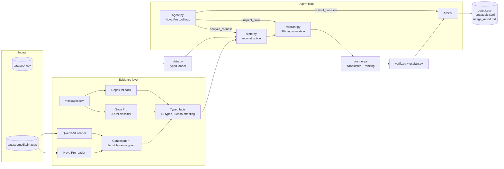
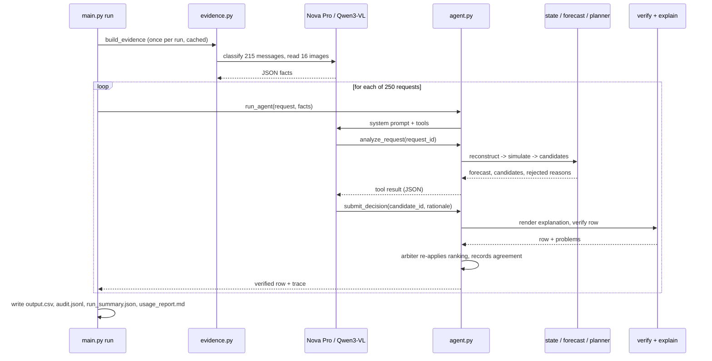

<div align="center">

# Buy or Wait?

### A financial decision agent that tells a person whether they can safely afford a purchase today, with a plan, later, or not at all

[](https://www.python.org/)
[](https://aws.amazon.com/bedrock/)
[](tests/)
[-blue)](requirements.txt)
[](#license)

[**Repository**](https://github.com/adarshcod30/buy-or-wait-financial-agent) &nbsp;·&nbsp; [**Architecture**](ARCHITECTURE.md) &nbsp;·&nbsp; [**Design notes**](DESIGN_NOTES.md) &nbsp;·&nbsp; [**Usage report**](evaluation/usage_report.md)

*Built for **HackerRank Orchestrate, September 2026**, a 24-hour agentic-AI hackathon.*

</div>

---

## Table of Contents

- [Overview](#overview)
- [Key Features](#key-features)
- [Tech Stack](#tech-stack)
- [System Architecture](#system-architecture)
- [Request Flow](#request-flow)
- [Financial Reconstruction Pipeline](#financial-reconstruction-pipeline)
- [Results](#results)
- [Deployment and Infrastructure](#deployment-and-infrastructure)
- [Project Structure](#project-structure)
- [Getting Started](#getting-started)
- [Usage and CLI Reference](#usage-and-cli-reference)
- [Testing](#testing)
- [Safety and Edge Cases](#safety-and-edge-cases)
- [Roadmap](#roadmap)
- [Contributing](#contributing)
- [License](#license)
- [Contact](#contact)

---

## Overview

**Problem.** "Can I afford this laptop?" is not a balance check. The honest answer depends on the
rent due next week, the salary that lands on the 15th, a pending card authorisation, a payroll
message saying next month's pay is reduced, a bill whose amount only exists in a photo, and the
minimum balance the person refuses to go below. It also depends on what the person will accept:
some will not use installments, some will not pay in parts, some will cancel a streaming plan to
make it work.

**Solution.** For each of 250 requests the agent reconstructs the user's cash position from a
25,342-row ledger, interprets 215 messages and 16 document images into typed facts, forecasts
the balance day by day for 90 days, enumerates every payment plan the seller offers and the user
accepts, keeps only the plans that never breach the minimum balance, ranks them by the
challenge's rule, and writes one verified row with a grounded explanation.

**Why it matters.** Every number in the output can be traced to a line in the ledger, a fact
from a message, or a branch in the code. The model is used where the data is unstructured
(messages, images, choosing and explaining among verified candidates), never for arithmetic.

**Keywords:** `financial-agent` `cash-flow-forecasting` `amazon-bedrock` `nova-pro` `tool-use`
`structured-extraction` `vision-language-model` `deterministic-verification` `hackerrank-orchestrate`

## Key Features

| Feature | Description |
|---|---|
| 90-day safety simulation | Day-by-day balance path from reconstructed flows; `amount_safe_to_pay` and the earliest safe full-payment date fall out of it directly |
| Typed evidence layer | 18 closed fact types; messages classified by Nova Pro with strict JSON at temperature 0, regex fallback over the observed templates, only 8 types may touch cash |
| Two-reader image extraction | Nova Pro and Qwen3-VL read every document image; disagreements resolved by the user's plausible range, then by the evidence line |
| Plan search with preferences | Full, partial (two payments), each seller installment option, wait, and spending-change variants, filtered by the user's accepted methods and installment horizon |
| Smallest-disruption spending changes | Up to three stop/reduce actions on permitted flexible series, chosen by minimal monthly saving, never on a protected category |
| Agent loop with an arbiter | The model drives `analyze_request`, `inspect_flows`, `submit_decision`; the deterministic ranking is re-applied so a model choice cannot alter a graded field silently |
| Contract verifier with self-repair | Every rendered row is re-checked against the submission contract before it is written; if the top-ranked plan fails, the next-ranked safe plan is emitted instead of an invalid row |
| Per-candidate proof trace | Every candidate records whether its counterfactual forecast held, its lowest projected balance and the first date it breached; 335 proofs across the 250 requests |
| Grounded explanations | Six templates derived from the solved samples, filled from the decision object, with a numeric consistency check |
| Runs without a key | `--mode deterministic` produces a valid `output.csv` from cached or regex evidence when the provider is unavailable |
| Measured usage report | Every model call is recorded (tokens, latency, cache hit); `evaluation/usage_report.md` is generated from the final run |

## Tech Stack

| Layer | Technology |
|---|---|
| Language | Python 3.11+ (standard library for data, dates, CSV, simulation) |
| Model provider | Amazon Bedrock Converse API, `us-east-1` |
| Primary model | `us.amazon.nova-pro-v1:0` (messages, images, agent loop, tool use) |
| Second-opinion vision model | `qwen.qwen3-vl-235b-a22b` (image consensus) |
| SDK | `boto3` with `botocore[crt]` (the only runtime dependency) |
| Caching | Content-addressed JSON cache of model responses under `.cache/llm/` |
| Testing | `pytest`, 24 tests, no network |
| Secrets | AWS credential chain only (profile, SSO, or environment); nothing in the repo |

## System Architecture

The system is a deterministic financial core wrapped by an agent. Structured data flows through
typed loaders into a reconstruction that produces dated cash flows; unstructured evidence
(messages, images) is turned into typed facts by the model and applied to those flows under
fixed rules; the simulator, planner and verifier are pure functions of the result. The model
sits on top as an orchestrator: it calls the tools, checks that the evidence and the forecast
are consistent, chooses among verified candidates and writes the rationale. An arbiter
re-applies the ranking rule after the model submits.



## Request Flow



## Financial Reconstruction Pipeline

This project has no trained model; the pipeline reconstructs a financial state and forecasts it.
Each stage below names what it reads, what it decides, and where that decision was validated.

### 1. Data sources and joins
- `financial_profiles.csv` (275 users), `financial_events.csv` (25,342 rows), `requests.csv`
  (250), `sample_requests.csv` (25 solved), `request_payment_options.csv` (790 options, 2 to 4 per
  request), `exchange_rates.csv` (134 dated rates), `messages.csv` (215), `images.csv` (16).
- Joins on `user_id`, `request_id`, `related_event_id`, and `(rate_date, from, to)`. Blank amounts
  stay `None` until an image resolves them; never zero.

### 2. Cleaning and conflict resolution
- Ignored: `cancelled`, `failed`, `unrealized`, `non_cash` rows; pending credits; refunds and
  prizes until they settle (statuses are a closed set, checked programmatically).
- Reserved: pending debits (charged at request date), scheduled debits and credits on their
  settlement date.
- Duplicates: a single-occurrence salary row with the same amount within 7 days of another
  salary row is a second representation of the same payroll and is not projected twice.
- Currency: foreign rows convert with the exact rate row for their settlement date; every
  scheduled foreign salary in the dataset has one. Fallbacks (nearest earlier, inverse, USD/EUR
  hop) are recorded in the audit notes.

### 3. Recurrence and forecasting rules
| Flow | Rule | Where validated |
|---|---|---|
| Recurring income | Only payroll-type descriptions; one series per description; needs two occurrences or a confirming row; stale after 45 days; stopped by "Final employer payroll" or an `income_ended` fact | samples 05, 10, 13, 14 |
| Fixed commitments | Per description, monthly cadence, last amount if constant else mean; dated on request day still owed | samples 06, 19, 20 |
| Variable spending | Per category on the observed cadence (weekly, fortnightly, ten-day, monthly); budget = `2 x minimum_allowed_amount` (dining, streaming, entertainment, gym), `minimum / 0.4` (shopping), else history mean | ratio measured on every reducible series in the corpus |
| Evidence | salary amount/date changes, confirmed first salary, approved invoices, arrears, rent percent increases, income ended | messages 01, 05, 06, 10, 11, 12, 24 |

### 4. Simulation and capacity
- Balance path from `request_date` for 90 days; the trough minus `minimum_balance_to_keep`, clamped
  to `[0, requested_amount]`, is `amount_safe_to_pay`.
- `earliest_date_for_full_payment` is the first day whose suffix-minimum balance minus the full
  amount stays at or above the minimum.

### 5. Plans and ranking
- Candidates: full today; each installment option (user must accept installments and
  `number_of_payments <= max_installment_months`); partial (two payments, second on the earliest
  date, on or before the deadline); wait (full amount on the earliest date); each of these with a
  spending-change set when needed.
- Ranking: completes by deadline, no spending changes, lowest total paid, earlier start, fewer
  payments, lowest option id (`planner.Plan.sort_key`).

### 6. Verification
- `verify.py` rejects any row violating the contract; `explain.check_consistency` rejects an
  explanation whose numbers disagree with the row. Problems are attached to the audit record.

## Results

### Provider benchmark (16 eye-verified images + 14 typed message templates, temperature 0)

| Model | Images | Messages | p50 latency | p95 latency |
|---|---|---|---|---|
| **Nova Pro** (chosen) | 16/16 | 14/14 | 1.25 s | 2.5 s |
| Qwen3-VL 235B (second opinion) | 16/16 | 14/14 | 1.79 s | 5.1 s |
| Kimi K2.5 | 15/16 | 14/14 | 1.08 s | 5.3 s |
| Nova 2 Lite | 15/16 | 14/14 | 0.95 s | 1.6 s |
| Llama 4 Maverick | 14/16 | 14/14 | 0.68 s | 1.0 s |
| Mistral Large 3 | 14/16 | 13/14 | 1.04 s | 1.4 s |
| Nova Lite | 14/16 | 14/14 | 0.95 s | 2.6 s |
| Grok 4.6 | 0/16 | 0/14 | errors on every call | |

Claude and GPT models return AccessDenied on this account; Nova Premier is marked legacy.

### Sample evaluation (25 solved requests, `python code/main.py evaluate`)

| Field | Exact match |
|---|---|
| affordability_status | 22/25 |
| recommended_payment_method | 23/25 |
| payment_plan | 22/25 |
| earliest_date_for_full_payment | 20/25 |
| spending_changes_needed | 21/25 |
| decision_explanation (verbatim) | 17/25 |
| amount_safe_to_pay within 5% | 11/25 (median relative error 6.8%) |

Why the amounts are close but rarely exact: the organizer forecasts variable spending from hidden
per-occurrence budgets (the gold troughs are integers or fixed-amount sums, e.g. 157.00, 452.00,
539.10 = rent 254.10 + 285). History is those budgets with noise; where a reducible item exposes
its budget through `minimum_allowed_amount` the estimate is exact, elsewhere the history mean is
the best unbiased estimate. The remaining categorical misses are requests whose amount sits
within 1 to 7% of a threshold that flips the plan, plus one freelancer whose irregular income the
rules deliberately do not project.

### Final full-dataset run (250 requests, agent mode, Nova Pro)

| Measure | Value |
|---|---|
| Rows written / verifier problems | 250 / 0 |
| Status mix | affordable_now 59, affordable_with_plan 75, affordable_later 53, not_affordable 63 |
| Method mix | full_payment 68, installments 56, wait 53, partial_payment 10, not_recommended 63 |
| Rows with spending changes | 25 (all on permitted flexible series) |
| Agent turns per request | 2.0 (analyze_request, submit_decision) |
| Model choice agreed with the arbiter | 246 / 250 |
| Provider fallbacks | 0 |
| Model calls / tokens / estimated cost | 747 / 929,476 / USD 0.93 (see `evaluation/usage_report.md`) |

The four disagreements are instructive: in two the model argued "the full amount is safe today,
so installments are unnecessary" for users who do not accept full payment; in two it called a
plan unsafe while ignoring the spending changes attached to it. The arbiter kept the verified
candidate in all four, and each case is recorded in `runs/audit.jsonl` with the model's
rationale. `runs/run_summary.json` holds the distributions above.

## Deployment and Infrastructure

- **Hosting:** none required; the agent is a local batch process (`python code/main.py run`).
- **Provider:** Amazon Bedrock on-demand in `us-east-1`; no provisioned throughput, no servers.
- **Cost:** the full run is on the order of one US dollar (see the usage report); evidence
  extraction for the whole corpus was USD 0.20.
- **Environments:** `.env.example` documents the variables; the AWS credential chain supplies
  credentials (profile, SSO, or environment). `AWS_REGION`, `BOW_MODEL_ID`,
  `BOW_FALLBACK_MODEL_ID`, `BOW_PRICE_JSON` override defaults.
- **Monitoring:** `runs/audit.jsonl` (per request), `runs/run_summary.json` (run level),
  `evaluation/usage_report.md` (tokens and cost). The client records every call with latency,
  cache state and error text.
- **Degradation:** provider errors (expired session, access denied, timeouts) fall back to the
  deterministic path per request and are counted in the summary.

## Project Structure

```text
code/
├── main.py                     CLI: run | evidence | evaluate | validate
├── README.md                   this file
├── DESIGN_NOTES.md             decisions, evidence, rejected alternatives
├── requirements.txt            boto3, botocore[crt] (pytest for tests)
├── .env.example                configuration variables
├── prompts/
│   ├── message_facts.md        message -> typed fact (system prompt)
│   ├── image_amount.md         image -> amount (system prompt)
│   └── agent_system.md         agent loop system prompt
├── buyorwait/
│   ├── config.py               paths, horizon, money epsilon
│   ├── data.py                 typed dataset loader
│   ├── fx.py                   dated currency conversion
│   ├── evidence_types.py       Fact, fact types, cash-affecting subset
│   ├── evidence.py             model + regex extraction, image consensus
│   ├── state.py                reconstruction into dated flows
│   ├── forecast.py             90-day simulation, safe amount, earliest date
│   ├── planner.py              candidates, spending changes, ranking
│   ├── verify.py               submission-contract verifier
│   ├── explain.py              templates + consistency check
│   ├── pipeline.py             one request end to end
│   ├── agent.py                Bedrock tool loop + arbiter
│   └── llm/bedrock.py          Converse client, cache, usage accounting
├── package.sh                  builds submission/{code.zip,output.csv,log.txt}
├── evaluation/
│   ├── main.py                 sample scorer (field by field)
│   ├── requirements_check.py   verifies the submission against every stated requirement
│   ├── audit.py                end-to-end specification audit over the produced output.csv
│   ├── policy_experiments.py   24-configuration grid with leave-one-out cross-validation
│   ├── policy_experiments.md   its output, the selected policy and the evidence for it
│   └── usage_report.md         generated by the final run
└── tests/                      24 pytest tests
```

## Getting Started

```bash
git clone https://github.com/interviewstreet/hackerrank-orchestrate-september26.git
cd hackerrank-orchestrate-september26
python3 -m venv .venv && source .venv/bin/activate
pip install -r code/requirements.txt
```

Configure AWS credentials for Bedrock (any of: `aws login`, `aws sso login`, an IAM profile, or
`AWS_ACCESS_KEY_ID`/`AWS_SECRET_ACCESS_KEY` in the environment). Then:

```bash
python code/main.py run
```

This writes `output.csv` at the repository root, `runs/audit.jsonl`, `runs/run_summary.json` and
`code/evaluation/usage_report.md`, then validates the CSV against the submission contract.

Without any credentials:

```bash
python code/main.py run --mode deterministic
```

## Usage and CLI Reference

| Command | What it does |
|---|---|
| `python code/main.py run` | Agent mode: evidence extraction (cached), tool loop per request, verified rows |
| `python code/main.py run --mode deterministic` | No model calls; cached or regex evidence, deterministic ranking |
| `python code/main.py run --limit 20` | First 20 requests (validation skips the missing-row check) |
| `python code/main.py run --debits-first` | Clear a day's debits before its credits in the simulation |
| `python code/main.py evidence` | Interpret all messages and images once; writes `.cache/facts.json` |
| `python code/main.py evaluate [--show request_08]` | Score the 25 samples field by field; `--show` dumps flows for one |
| `python code/main.py validate` | Re-check `output.csv` against the contract |
| `python code/evaluation/requirements_check.py` | PASS/FAIL line per requirement (columns, bounds, contract, usage report, secrets, tests) |
| `python code/evaluation/audit.py` | End-to-end audit: 37 checks walking the specification over all 250 rows, plus coverage gaps, dataset anomalies and distribution drift |
| `python code/evaluation/policy_experiments.py` | Scores all 24 forecast-policy configurations on the samples and cross-validates the selection |
| `python -m pytest code/tests -q` | Run the test suite |

Output columns, in order: `request_id, amount_safe_to_pay, affordability_status,
recommended_payment_method, payment_plan, earliest_date_for_full_payment,
spending_changes_needed, decision_explanation`.

## Testing

- `code/tests/test_fx.py`: exact, inverse, nearest-earlier and hub conversions; missing rate raises.
- `code/tests/test_forecast.py`: trough and safe amount, salary-day ordering, adjustments.
- `code/tests/test_planner.py`: each status and method, installment eligibility, partial beats
  wait, a spending change that meets the deadline beats a late wait, nothing eligible.
- `code/tests/test_verify_and_explain.py`: contract rules, money formatting, consistency check.
- `code/tests/test_evidence_and_state.py`: regex facts in English and Indonesian, scam and
  pending messages have no cash effect, income classification, cadence, budget ratios, and the
  full contract on all 25 samples.
- `code/tests/test_invariants.py`: 23 metamorphic and property tests that must hold for every
  input, not just the samples. Monotonicity of safe capacity under perturbation, plan-shape
  invariants, spending-change permissions, and the guarantee that every returned plan is safe
  under its own counterfactual forecast.

## Safety and Edge Cases

- Prompt injection: messages and images are data. The only path from them to the forecast is a
  closed fact schema; the corpus's "pay the release charge to receive the prize" message maps to
  `scam_solicitation`, which cannot touch cash.
- Blank amounts: excluded with a note if no reader returns a plausible amount; never zero.
- Missing image file or missing rate: recorded, never invented.
- Pending credits, bonuses, commissions, refunds, prizes, unrealized gains: never counted.
- Provider unavailable or session expired: per-request fallback to the deterministic path,
  counted in the summary; output stays valid.
- Rows that fail verification are still written (the contract needs one row per request) with
  the problem attached in the audit; a run with problems exits non-zero.

## Roadmap

- Learn per-user budgets jointly across categories from the sample troughs instead of per-series means.
- Second-opinion classification for low-confidence message facts.
- Scenario view in the audit: the balance path under each candidate plan.

## Contributing

Issues and pull requests are welcome. Run the tests and `python code/main.py evaluate` before
opening a PR and include the before/after numbers in the description.

## License

MIT.

## Contact

Adarsh Dwivedi, [github.com/adarshcod30](https://github.com/adarshcod30).
