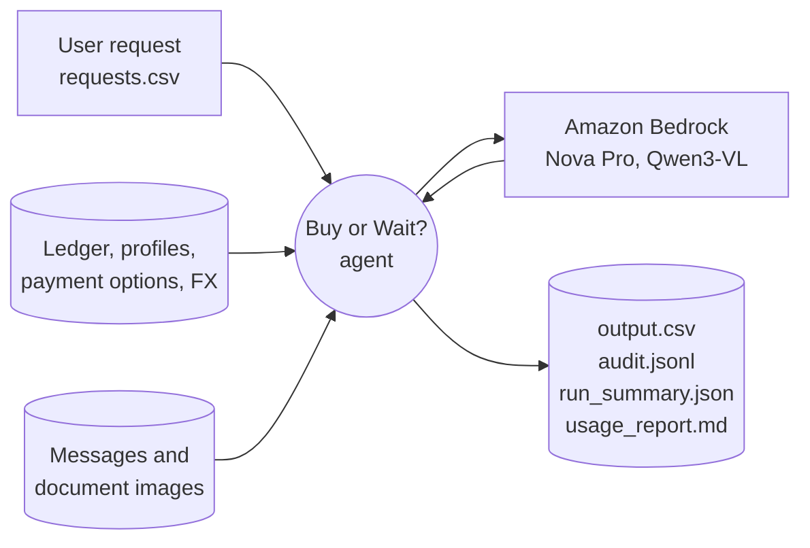
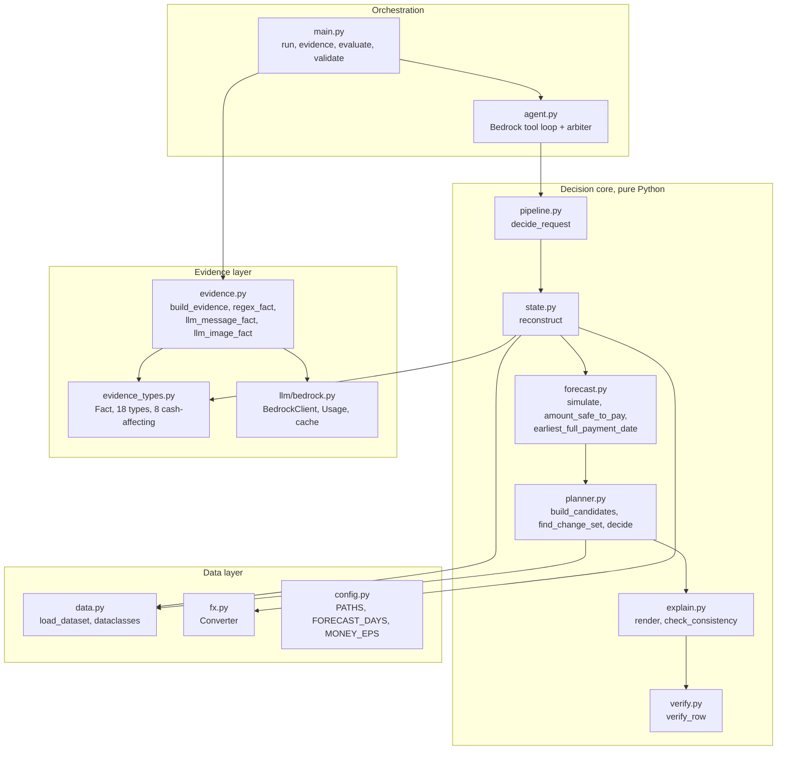
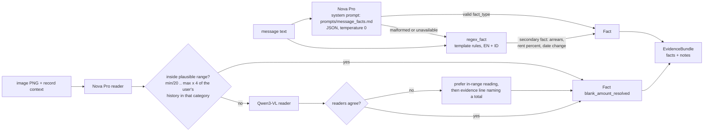
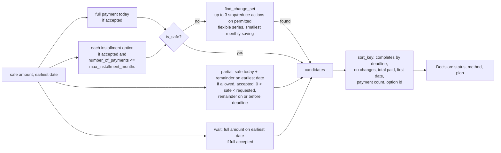
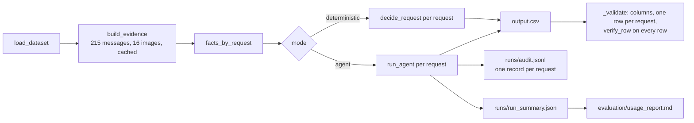
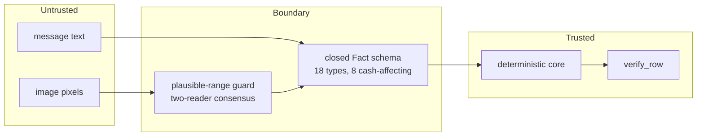

# Buy or Wait? System Architecture

This document describes the architecture of the Buy or Wait? financial decision agent: what
the pieces are, what each one owns, how data moves between them, and where the trust and
correctness guarantees live. Every module, function and number named here exists in the code
under `code/`.

## 1. Context



The system is a local batch process. It reads only the participant dataset, calls Amazon
Bedrock for the two things the data cannot answer deterministically (what an untrusted message
or image says, and a rationale for a choice among verified plans), and writes one verified row
per request plus an audit trail.

Design principle: **numbers are computed, words are generated.** Every graded numeric field
is produced by deterministic code; the model classifies evidence, orchestrates tools and writes
the rationale.

## 2. Layered view



| Layer | Modules | Owns | Never does |
|---|---|---|---|
| Data | `data.py`, `fx.py`, `config.py` | Typed loading of nine CSVs, joins, dated currency conversion, paths and constants | Interpret text, forecast |
| Evidence | `evidence.py`, `evidence_types.py`, `llm/bedrock.py` | Turning messages and images into typed facts; provider access, retries, cache, usage accounting | Change a cash flow directly |
| Decision core | `state.py`, `forecast.py`, `planner.py`, `explain.py`, `verify.py`, `pipeline.py` | Reconstruction, simulation, plan search, ranking, rendering, contract verification | Call the network |
| Orchestration | `agent.py`, `main.py` | Tool loop, arbiter, batch run, artifacts | Compute money |

## 3. Data model

```mermaid
classDiagram
    class Profile { user_id; home_currency; current_available_balance; minimum_balance_to_keep; protect; willing_to_reduce; willing_to_stop; payment_methods; max_installment_months }
    class Event { event_id; user_id; event_type; description; category; direction; amount?; currency; event_date; settlement_date; status; linked_event_id; flexibility; minimum_allowed_amount? }
    class Request { request_id; user_id; request_date; request_type; requested_amount; desired_completion_date; allows_partial_payment; request_text }
    class PaymentOption { payment_option_id; request_id; payment_method; payment_amount; number_of_payments; first_payment_date; payment_frequency_days; financing_fee; total_payable_amount; schedule() }
    class Fact { fact_type; source_id; source_kind; related_event_id; request_id; amount?; currency?; effective_date?; percent?; confidence; provenance; raw }
    class Flow { date; amount; kind; label; series_key; source_event_id; category; flexibility; source_fact }
    class Reconstruction { profile; request_date; opening_balance; flows; adjustable; notes; applied_facts }
    class Plan { method; payments; changes; option_id; total_paid; sort_key() }
    class Decision { amount_safe_to_pay; earliest_full_payment; status; method; plan; candidates; rejected; trough; trough_date }
    Profile "1" --> "*" Event
    Request "1" --> "2..4" PaymentOption
    Fact ..> Event : related_event_id
    Reconstruction o-- Flow
    Decision o-- Plan
```



`amount` is `None` for the 16 ledger rows whose value only exists in an image; it is never
treated as zero. `Flow.series_key` groups every projected occurrence of one commitment so the
planner can stop or reduce the whole series at once.

## 4. Evidence layer



Fact types (`evidence_types.FACT_TYPES`): salary_amount_change, salary_date_change,
salary_confirmed, income_ended, income_pending_not_counted, invoice_approved,
one_time_credit_confirmed, rent_increase_pct, new_recurring_debit, internal_transfer,
unrealized_value_change, already_settled_credit, failed_debit_retry, fx_settlement_note,
card_minimums_separate, scam_solicitation, blank_amount_resolved, other.

Only the eight in `CASH_AFFECTING` can change a projected flow. This is the trust boundary:
an instruction embedded in a message has no representation in the schema and therefore no
path into the forecast.

`BedrockClient` (in `llm/bedrock.py`) keys every call by a SHA-256 of model, system prompt,
tool config and content (image bytes hashed), stores responses under `.cache/llm/`, retries
throttling and timeouts three times, stops immediately on access, credential or dependency
errors, and records a `CallRecord` (model, purpose, tokens, latency, cached, ok) per call.
`Usage.summary()` produces the per-model and total figures in `evaluation/usage_report.md`.

## 5. Decision core

### 5.1 Reconstruction (`state.reconstruct`)

```mermaid
flowchart TB
    IN[events for user + facts] --> R1[Resolve blank amounts<br/>from blank_amount_resolved facts]
    R1 --> R2[Known future rows<br/>scheduled debits/credits on settlement date,<br/>pending debits reserved on request_date,<br/>pending credits ignored,<br/>cancelled/failed/unrealized/non_cash ignored]
    R1 --> R3[Recurring income<br/>payroll-type descriptions only, one series per description,<br/>2 occurrences or scheduled/confirmed row, stale after 45 days,<br/>final payroll or income_ended stops it,<br/>amount/date changes and arrears applied]
    R1 --> R4[Fixed commitments per description<br/>monthly cadence, last amount if constant else mean,<br/>rent_increase_pct applied, request-day rows still owed]
    R1 --> R5[Variable spending per category<br/>groceries, transport, dining, shopping, entertainment<br/>cadence from median gap over 180 days,<br/>budget = 2 x min (dining/streaming/entertainment/gym),<br/>min / 0.4 (shopping), else mean; request-day not projected]
    R2 --> OUT[Reconstruction: flows sorted by date,<br/>adjustable series, notes, applied_facts]
    R3 --> OUT
    R4 --> OUT
    R5 --> OUT
```

Foreign-currency rows convert through `fx.Converter` with the exact rate row for the
settlement date; fallbacks (nearest earlier, inverse, USD/EUR hop) are written to `notes`.

### 5.2 Simulation (`forecast.py`)

`simulate` walks 91 calendar days from `request_date`, applying each day's flows (end-of-day
netting by default; `debits_before_credits=True` clears debits first). It returns the daily
balance path, the trough and its date.

* `amount_safe_to_pay = clamp(trough - minimum_balance_to_keep, 0, requested_amount)`
* `earliest_full_payment_date` = the first day whose suffix-minimum balance minus the full
  amount stays at or above the minimum.
* `is_safe(payments, adjustments)` re-runs the simulation with a candidate plan's payments
  and any stop/reduce adjustments; this is the only safety oracle the planner uses.

### 5.3 Plan search and ranking (`planner.py`)



Status mapping in `decide`: full payment without changes is `affordable_now`; `wait` is
`affordable_later`; any other candidate is `affordable_with_plan`; no candidate is
`not_affordable` / `not_recommended`.

### 5.4 Rendering and verification

`explain.render` fills one of six templates taken from the solved samples with numbers from
the `Decision`; `explain.check_consistency` rejects a sentence whose amounts disagree with the
row. `verify.verify_row` re-parses the rendered row and enforces the contract: bounds, allowed
values, chronological plan that sums to the request, installment schedule equal to a supplied
option, the partial-payment structure and deadline, spending changes only on permitted
flexible events in non-protected categories, `affordable_now` implies
`earliest == request_date`. Problems are attached to the row's audit record; the row is still
written because the contract requires one row per request, and the run exits non-zero.

## 6. Agent loop and arbiter (`agent.py`)

```mermaid
sequenceDiagram
    participant M as Nova Pro
    participant A as run_agent
    participant C as decide_request (core)
    A->>C: decide_request(request, facts)
    C-->>A: RowResult (row, decision, reconstruction)
    A->>M: system prompt (prompts/agent_system.md) + tools, toolChoice any
    M->>A: analyze_request(request_id)
    A-->>M: request, profile, applied facts, notes, forecast,<br/>candidates with candidate_id and ranking_key, rejected reasons
    opt model wants detail
        M->>A: inspect_flows(request_id, limit)
        A-->>M: flows up to the trough date
    end
    M->>A: submit_decision(candidate_id, rationale)
    A->>A: arbiter: compare candidate_id with the ranked choice;<br/>record agreed / disagreed; row unchanged
    A-->>A: AgentTrace (turns, tool_calls, model_choice, arbiter_choice, rationale, fallback)
```

Tools are declared in `agent.TOOLS` with JSON input schemas. The loop runs at most `MAX_TURNS`
= 6 turns. Provider failure, a submission naming a non-candidate, or no submission within the
budget all leave the deterministic row in place and record why in the trace. In the final run
the model needed 2.0 turns per request and agreed with the arbiter on 246 of 250 requests.

## 7. Batch flow (`main.py run`)



Other commands: `evidence` (extract and cache facts only), `evaluate` (field-by-field score
against the 25 samples, `--show` dumps one request's flows and candidates), `validate`
(re-check an existing output.csv). `evaluation/requirements_check.py` prints PASS/FAIL per
stated requirement.

## 8. Runtime, configuration and deployment

| Concern | Choice |
|---|---|
| Runtime | Python 3.11+, one runtime dependency (`boto3` with `botocore[crt]`) |
| Provider | Amazon Bedrock Converse API, `us-east-1`, on-demand |
| Models | `us.amazon.nova-pro-v1:0` primary; `qwen.qwen3-vl-235b-a22b` second image reader |
| Credentials | AWS credential chain only (`aws login`, SSO, profile, environment); nothing in the repo |
| Configuration | `AWS_REGION`, `BOW_MODEL_ID`, `BOW_FALLBACK_MODEL_ID`, `BOW_PRICE_JSON`, `BOW_REPO_ROOT`, `BOW_FORECAST_DAYS` |
| Determinism | temperature 0, content-addressed cache, arbiter; graded fields are pure functions of the dataset and facts |
| Cost and time | final run: 747 calls, 929k tokens, USD 0.93; 55 s with a warm cache, about 13 min cold |
| Degradation | per-request fallback to the deterministic path when the provider fails; `--mode deterministic` needs no credentials |
| Observability | `runs/audit.jsonl`, `runs/run_summary.json`, `evaluation/usage_report.md`, `CallRecord` per model call |

## 9. Security and trust boundary



* Prompts state that evidence is data and that instructions inside it are ignored; the schema
  makes that structural rather than behavioural. The corpus's scam message ("pay the release
  charge to receive the prize") maps to `scam_solicitation`, which cannot touch cash.
* Sample labels are read only by the evaluator; `requirements_check.py` asserts that no module
  under `buyorwait/` touches `SampleRow` label fields.
* No secrets in code; `.env`, caches, `log.txt`, `runs/` and `submission/` are ignored by git.

## 10. Failure modes and where they surface

| Failure | Behaviour | Visible in |
|---|---|---|
| Blank amount with no readable image | row excluded from the forecast, never zero | `Reconstruction.notes`, audit |
| Missing FX rate | fallback recorded; a truly missing pair raises at load | notes, `FxError` |
| Model returns malformed JSON | regex fallback used | evidence notes |
| Image reading outside plausible range | second reader; in-range reading wins | evidence notes |
| Provider access or session error | no retry; deterministic path for that request | `AgentTrace.fallback`, run summary |
| Model picks a non-candidate or none | arbiter keeps the ranked candidate | `AgentTrace.notes`, audit |
| Row breaks the contract | row written with problems attached; non-zero exit | audit, validation log |

## 11. Testing

24 tests under `code/tests` cover conversion, simulation, ranking (including partial beating
wait and a spending change beating a late wait), verifier rules, money formatting, explanation
consistency, regex facts in English and Indonesian, income classification, cadence detection,
budget ratios, and the contract on all 25 samples. `evaluation/main.py` scores the samples
field by field; `evaluation/requirements_check.py` verifies the final output against the
stated requirements.
